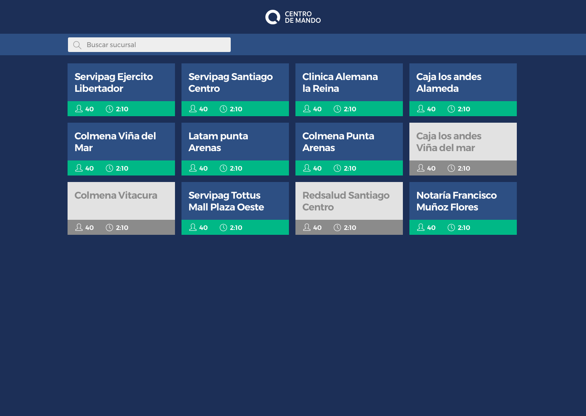

# Zero Q Frontend Challenge

## Introduction

Zero Q is looking for a Frontend Developer to include on their team. In that project, I show how are my coding skills developing this web prototype for Zero Q Frontend Challenge. This is a very simple and reduced version of Zero Q real-time dashboard (https://zeroq.cl/command/).

## Mockup of how the prototype should look

## Requirements
- Install npm
- Install node

## Installation 

Clone or download the repository

### `git clone https://github.com/aleonsalinas/command-center-zeroq.git`

In the project directory, run to install node packages:

### `npm install`

## Running App

In the project directory, you can run:

### `npm start`

## Testing App

### `npm test`

## Final Notes

- This app was developed on React

- TDD specification: React-scripts test and Enzyme.
